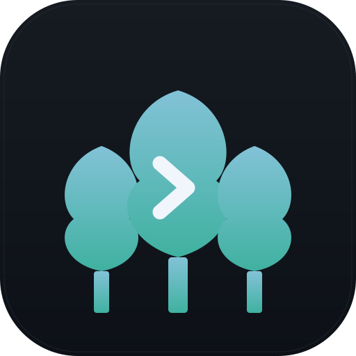

<h1>
  
  Grove
</h1>

> A terminal where every command remembers its context, and the things you reach for next — the preview, the files, the diff — are already there.

Grove is a macOS dev environment built around a single idea: most of what you do after running a command is predictable. You check what changed. You look at a file. You hit the dev server. Grove puts all of that one panel away, and makes the terminal itself remember enough about each command that the answer is usually already on screen.

> **Status:** pre-alpha, macOS only. The pieces below marked ✅ work today. The ones marked 🚧 are the next milestones — see [Roadmap](#roadmap).


---

## The dev loop, collapsed

A normal day in a normal terminal:

```
$ npm run dev          → open browser, navigate to localhost:5173
$ git status           → squint at output, mentally diff
$ vim src/App.tsx:42   → context switch to editor
```

In Grove that's one window. Click the URL in `npm run dev` output → Browser panel opens it. Click `src/App.tsx:42` in a stack trace → Files panel jumps there. Diff panel is already showing what you've changed.

---

## What ships today

### ✅ Warp-style blocks with real shell integration

Every command is its own block. Every block knows:

- Exit code, duration, exact cwd at run time
- Live env at that moment: node version, git branch, virtualenv, AWS profile
- OSC 133 + custom `grove-pre` / `grove-post` / `grove-env` markers — no polling
- Per-block menu: rerun, copy, delete

Blocks persist to `~/.grove/blocks/{tabId}.json` and survive restarts. Shell integration is wired via custom `ZDOTDIR` so your aliases and rc still load.

### ✅ Grouped vertical tabs with pinned cwd

Drag tabs between named workspaces. Each workspace pins its own working directory. No more re-cd, no tmux gymnastics for parallel work.

### ✅ Three-panel right side: Browser / Files / Diff

Mutually exclusive, ~40% of content width, toggled per tab.

- **Files** — virtualized browser, `git ls-files` aware in repos with a guarded walk fallback, search, file preview
- **Diff** — live `git diff` of the current cwd, the view you'd see in PR review
- **Browser** — iframe-based today, discovers dev servers via `lsof`, strips `X-Frame-Options` / `frame-ancestors` for localhost, supports a 1280-min desktop viewport (scale-to-fit) or a 390 mobile frame. Per-workspace recents. Chrome-style "site can't be reached" page on connection failure.

### ✅ Clickable output

Paths (`src/App.tsx:10:5`), OSC 8 hyperlinks, and `http(s)` URLs in command output are all clickable. URLs open in the Browser panel; paths open in Files. ⌘-click from anywhere works.

### ✅ Streaming context

Backend pushes context changes over WebSocket (debounced) instead of clients polling. The chips on each block update live as you `cd`, switch branches, or change node versions.

---

## Roadmap

These are what Grove is becoming. Not in the box yet — listed roughly in priority order.

### 🚧 A real embedded browser (not an iframe)

Migrating the Browser panel to Electron's `WebContentsView` to fix the things iframe can't:

- Any cross-origin site, not just localhost — no header stripping needed
- **WebAuthn / security keys** for 2FA on staging and prod
- **Chrome extensions** including 1Password, via `electron-chrome-extensions`
- Persistent cookies scoped per workspace — staging in one tab, prod in another
- Real `setZoomFactor` for viewport scaling instead of CSS transforms

The iframe approach works fine for localhost dev servers, which is 80% of the use case. The migration unlocks the other 20%.

### 🚧 Git worktree as a first-class concept

Workspaces today are pinned cwds. The plan is to make them **git worktrees**: one repo, many branches checked out simultaneously, each in its own tab group.

- `Cmd+T` on a repo tab → "new worktree from branch", no `git worktree add` ceremony
- Each worktree gets its own port range and its own block history
- Cleanup on merge: prompt to prune the worktree when the branch is gone

### 🚧 Claude Code as the default shell

Each new tab launches into a Claude Code agentic session by default, with full repo context and your shell aliases preserved. Drop to raw zsh with `⌘\` when you need it. Sessions persist per worktree under `~/.grove/sessions/<branch>.jsonl`.

This is the bet that makes Grove different from "Warp but open-source." Whether it stays the *default* vs. an opt-in mode is still TBD.

### 🚧 Ask Claude on every block

Right-click a block → **Ask Claude**. Ships the full context — command, output, exit code, cwd, branch, env — in one shot. No more copy-paste-into-chat-window.

### 🚧 Block sharing

A block already has everything needed to reproduce it. One-click "share" produces a snippet a teammate can paste back, or a bug-report-quality dump.

---

## Stack

- **Electron** shell — custom titlebar, IPC for folder picker, open external, frame nav forwarding
- **React 18 + Chakra v3 + Vite + Zustand** (persisted to localStorage)
- **Fastify + WebSocket + node-pty** backend on `127.0.0.1:4317`
- **xterm.js** for raw-mode TUI overlay (vim, htop, ssh, claude…)
- `lsof` for dev server discovery
- Custom **zsh integration** via `ZDOTDIR` for OSC 133 + Grove markers
- Disk-persisted block history at `~/.grove/blocks/{tabId}.json`

---

## Develop

```bash
npm install
npm run dev:all
```

`dev:all` builds the Electron main process, then runs backend + Vite + Electron in parallel. A `kill-ports` step nukes any stale listeners on `4317` and `5173` first so restarts don't conflict.

See [FEATURES.md](FEATURES.md) for the v1 scope.

---

Pre-alpha. macOS only. Built in the open. If something breaks, open an issue — once the **Ask Claude** action lands, Grove will help you write that issue.
